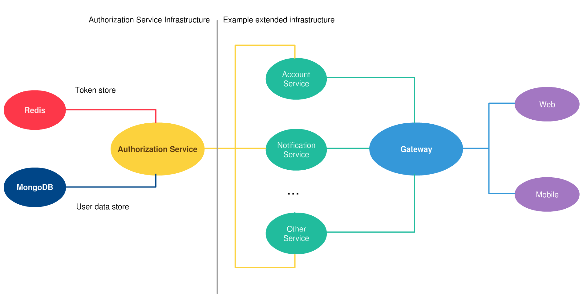
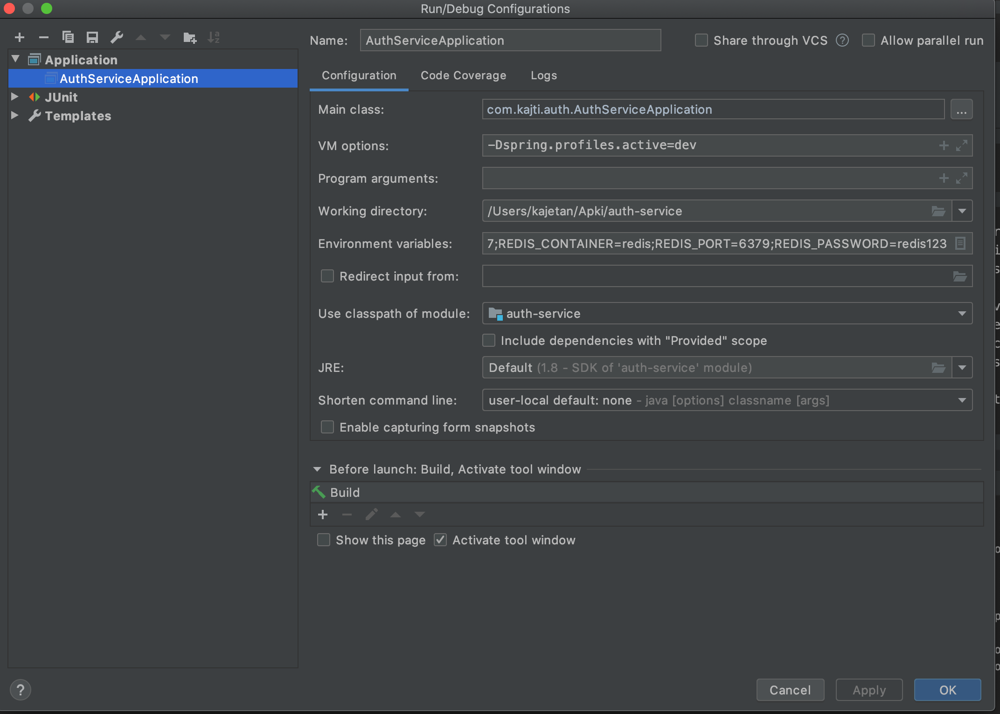

# Authorization service


Simple open source Authorization microservice. This service is used for user authorization as well as for secure machine-to-machine communication inside a perimeter. Uses Redis for token and MongoDB for user account data keeping. The highest quality of code, strong testing culture.



# How use

*Every make command have available `env` parameter.*

## Running

To run service in production mode, just use

```bash
make env=prod start
```

service will be available on `0.0.0.0:4000` address.

### Developing

To start developing, just use

```bash
make start
```

then go to IntelliJ and follow the instructions below

1. Go to `Run/debug configurations` and find `AuthServiceApplication`
2. Set VM options `-Dspring.profiles.active=dev`
3. Paste Enviroment variables from `.env` file
4. Save and click play button



## Create server client

To create client eg. for connect with another services, run:

```bash
make client='account-service' secret='$$2y$$12$$1Xf4lvYLDxYFfJTteebdAuRo4lxrQ1uj1tuhBdDeOPaQstYevfG8u' grants='client_credentials,refresh_token' scopes='server' client
```

**Secret must be encoded in bcrypt and escaped.**

## Endpoints

Method	| Path	| Description
------------- | ------------------------- | ------------- |
GET	| /users/current	| Get current user data
POST	| /users	| Create new user

## Tests

To run all test just use

```bash
make test
```

## Help

```bash
make help
```

```
start                          Clean current environment, recreate dependencies and spin up again
stop                           Stop environment
rebuild                        Same as start
erase                          Stop and delete containers, clean volumes.
build                          Build environment
up                             Spin up environment
ps                             Show containers list
package                        Maven package
test                           Run tests
logs                           Look for 's' service logs, make s=auth-service logs
client                         Create client, available arguments client,secret,grants,scopes
help                           Display this help message
```

# Contributions are welcome!

Authorization service is open source, and would greatly appreciate your help. Feel free to suggest and implement improvements.